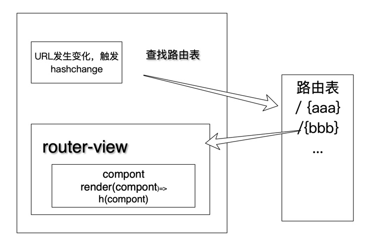

# vue01-预习

## SAP 应用 router-view 实现原理

### 不能离开当前页面，同时需要知道页面确实发生了变化

1. url+# 哈希值

url 发生变化，但是页面其实没有跳转

监听 hashChange => 查找路由表 => 绑定 router-view =>执行 render(h)=>h(component)=>触发重新渲染

1. H5 的 history API 页面依然不跳转

## vuex **实现原理**

1. 需要构建一个store对象，具有commit,dispatch的方法，
2. 需要调用init方法实现render
### 需要掌握
1. vue plugin
2. render(h)
3. 数据响应式 vue.util.defineReactive
   new Vue(data(){})
4. es6 class

## 直播课

### Vue的设计思想
将视图view的状态和行为抽象化，让我们将视图UI和业务逻辑分开。

mvvm框架的三要素，数据响应式，模板引擎，渲染
1. 数据响应式
   objet.defineProperty()
   proxy
2. 模板引擎
   插值表达式：{{}}
   指令：v-bind,v-on,v-model,v-for,v-if
3. 渲染 如何将模板渲染为html
   模板->vdom->dom

**问题：计算属性底层也是通过defineProperty来做精确的数据响应式操作**

### kvue/01-reactive.js
defineReactive 的功能是封装了一个方法，使给传进来的obj一个响应式的属性
### kvue/02.reactive.html
需要实现的内容就是如何进行数据的响应式更新，
实现update是需要在set阶段进行的