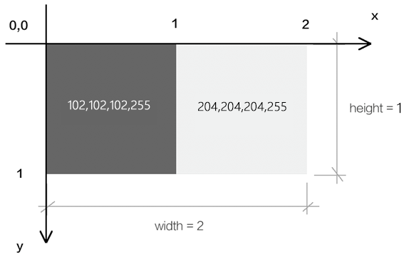

# 概述

牛逼

# webgl 最短教程

- 设置 css 是不能通过 gpu 动态修改的，可以理解为在页面完成 render 之后不再修改

```css
#canvas {
  background-color: antiquewhite;
}
```

```js
const gl = canvas.getContext("webgl"); //三维
//使用 gl.clearColor(),设置颜色缓冲区 COLOR_BUFFER_BIT
gl.clearColor(1, 0, 0, 1); //rgba(0-1)相当于0-255 相当于设置 COLOR_BUFFER_BIT
gl.clear(gl.COLOR_BUFFER_BIT); //这块clear，想到与生效
```

# api

WebGLRenderingContext.clearColor() 方法用于设置清空颜色缓冲时的颜色值。
void gl.clearColor(red, green, blue, alpha); //不透明度 （0-1）

# 1.4 css 颜色转 webgl 颜色

主要就是学习，怎么把 css 字符串的样式颜色转换成 webgl 的颜色

- 获取数据

```js
const cssColor = "rgba(255,100,88,1)";
const reg = RegExp(/\((.*)\)/);
/*  1.\(字符中的(,反斜杠表示作为参数查找
          2.正则中的() 表示捕获括号，根据参数表示不同意思
            (.) 表示除回车之外的所有字符；
            (.*) 表示匹配0个或者多个；  
      */
const rgbaStr = reg.exec(cssColor)[1];
```

- 加工并写入数据

```js
const rgba = rgbaStr.split(",").map((n) => parseInt(n));
console.log(rgba);
gl.clearColor(rgba[0] / 255, rgba[1] / 255, rgba[2] / 255, rgba[3]);
gl.clear(gl.COLOR_BUFFER_BIT);
```

# 1.5 多姿多彩的画布

- 使用 three.js 引入图片资源

```js
import { Color } from "https://unpkg.com/three/build/three.module.js";
```

- .offsetHSL ( h : Float, s : Float, l : Float ) : Color
  将给定的 h, s, 和 l 值加到当前颜色值。 内部的机制为：先将该颜色的 r, g 和 b 值转换为 HSL，然后与传入的 h, s, 和 l 相加，最后再将结果转成 RGB 值。
- .setHSL ( h : Float, s : Float, l : Float ) : Color
  h — 色相值处于 0 到 1 之间。hue value between 0.0 and 1.0
  s — 饱和度值处于 0 到 1 之间。
  l — 亮度值处于 0 到 1 之间。

# 1.6 webgl 坐标系

## webgl 3d 与 canvas 2d 坐标的区别

- webgl 3d
  1.y 轴向上，以画布中心为起点(0,0) 2.以画布最大值为 1
  
- canvas 2d
  1.y 轴向下，以画布左上角(0,0)为起点
  2.1px 为一个单位
  

# 1.7 webgl 绘图原理

- 浏览器有三大线程： js 引擎线程、GUI 渲染线程、浏览器事件触发线程。
- GUI 渲染线程就是用于渲图的，在这个渲染线程里，
  有负责渲染 HTML+css 的，有负责渲染二维图形，有负责渲染三维图形的
- 渲染二维图形的和渲染三维图形的语言不一样
- 渲染二维图形的是 js 语言。渲染三维图形的是 GLSL ES 语言。
- 在用 js 绘制 webgl 图形时，需要`程序对象`进行翻译

## webgl 的绘图思路

浏览器里内置的 webgl 渲染引擎，负责渲染 webgl 图形，只认 GLSL ES 语言。
程序对象，承载 GLSL ES 语言，翻译 GLSL ES 语言和 js 语言，使两者可以相互通信。

- 通过 canvas 获取的 webgl 类型的上下文对象，
- 向`程序对象`传递绘图命令，并接收`程序对象`的状态信息。
- 通过 webgl 类型的上下文对象，用 js 画画。

# 1.8 画一个点

## 1/3/03.canvas2d 绘制一个矩形.html

## 1/3/03.一个点.html

- 1.在 html 中建立 canvas 画布

```js
<canvas id="canvas"></canvas>
```

- 2.在 js 中获取 canvas 画布

```js
const canvas = document.getElementById("canvas");
```

- 3.使用 canvas 获取 webgl 绘图上下文

```js
const gl = canvas.getContext("webgl");
```

- 4.在 script 中建立顶点着色器和片元着色器，glsl es

```html
//顶点着色器
<script id="vertexShader" type="x-shader/x-vertex">
  void main() {
      gl_Position = vec4(0.0, 0.0, 0.0, 1.0);
      gl_PointSize = 100.0;
  }
</script>
//片元着色器
<script id="fragmentShader" type="x-shader/x-fragment">
  void main() {
      gl_FragColor = vec4(1.0, 1.0, 0.0, 1.0);
  }
</script>
```

```js
// 设置宽高
// 获取着色点  const vsSource = document.querySelector("#vertexShader").innerText;  const fsSource = document.querySelector("#fragmentShader").innerText;
// 创建三维画笔  const gl = canvas.getContext("webgl");
// 解析着色器文本，整合到程序对象里
// 关联webgl上下文对象，实现两种语言的相互通信
// 注意这个过程将initShaders方法导入进来，写在这个页面的时候出错了 不能渲染 我觉得应该是没有执行方法
initShaders(gl, vsSource, fsSource);
```
